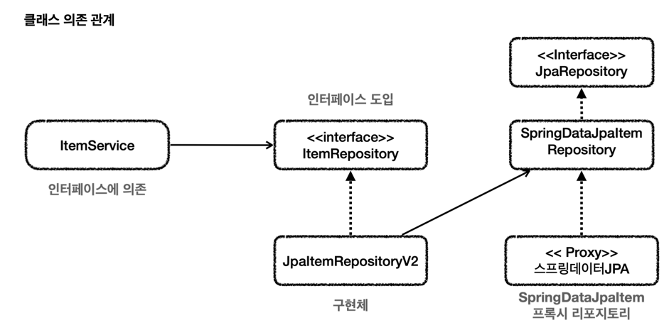

## 스프링 데이터 JPA 예제와 트래이드 오프
### 중간에 매개 어댑터를 두는 구조

`JpaItemRepositoryV2` 가 어댑터 역할을 해준 덕분에 `ItemService` 가 사용하는
`ItemRepository` 인터페이스를 그대로 유지할 수 있고 클라이언트인 `ItemService` 의 코드를 변경하지 않아도 된다.

* 단점
* 구조를 맞추기 위해 중간에 어뎁터가 들어가서 클래스가 많아지고 
* 개발자가 중간 어댑터와 실제 코드까지 봐야한다.

### 서비스가 리포지토리 직접 참조

ItemService` 에서 스프링 데이터 JPA로 만든 리포지토리를 직접 참조한다. 

* 단점
* 물론 이 경우 `ItemService` 코드를 변경해야 한다.
* 즉, OCP, DI 원칙을 지키지 못 한다.

### 트레이드 오프: 구조의 안정성 vs 단순한 구조와 개발의 편리성
방식 1: DI, OCP를 지키기 위해 어댑터를 도입하고 <-> 더 많은 코드를 유지한다.
방식 2: 어댑터를 제거하고 구조를 단순하게 가져가지만 <-> DI, OCP를 포기하고, `ItemService` 코드를 직접 변경한다.

어설픈 추상화는 오히려 독이 되는 경우도 많다. 
인터페이스를 통한 추상화도 결국 유지보수 비용이 드는 것이다.
추상화 비용 을 넘어설 만큼 효과가 있을 때 추상화를 도입하는 것이 실용적이다.

## 실용적인 구조
JPA와 동적 쿼리에 강한 Querydsl을 같이 사용하는 구조로 변경한다.

##### ItemRepositoryV2
JpaRepository 를 인터페이스 상속 받아서 스프링 데이터 JPA의 기능을 제공하는 리포지토리가 된다.
단순 조회 기능을 한다.

##### ItemQueryRepositoryV2
Querydsl을 사용해서 복잡한 쿼리 문제를 해결한다.

##### ItemServiceV2
ItemRepositoryV2 와 ItemQueryRepositoryV2 를 의존한다.