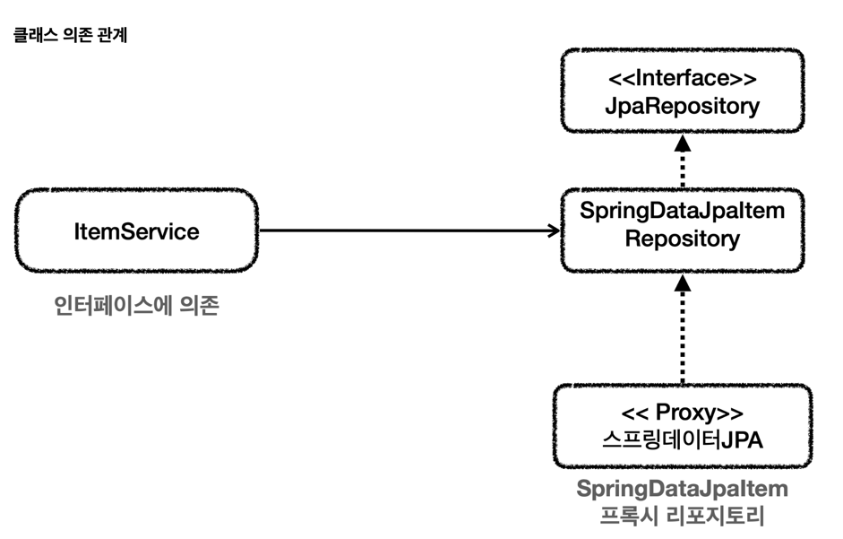

## 스프링 데이터 JPA 예제와 트래이드 오프
### 중간에 매개 어댑터를 두는 구조

`JpaItemRepositoryV2` 가 어댑터 역할을 해준 덕분에 `ItemService` 가 사용하는
`ItemRepository` 인터페이스를 그대로 유지할 수 있고 클라이언트인 `ItemService` 의 코드를 변경하지 않아도 된다.

* 단점
* 구조를 맞추기 위해 중간에 어뎁터가 들어가서 클래스가 많아지고 
* 개발자가 중간 어댑터와 실제 코드까지 봐야한다.

### 서비스가 리포지토리 직접 참조

ItemService` 에서 스프링 데이터 JPA로 만든 리포지토리를 직접 참조한다. 

* 단점
* 물론 이 경우 `ItemService` 코드를 변경해야 한다.
* 즉, OCP, DI 원칙을 지키지 못 한다.

### 트레이드 오프: 구조의 안정성 vs 단순한 구조와 개발의 편리성
방식 1: DI, OCP를 지키기 위해 어댑터를 도입하고 <-> 더 많은 코드를 유지한다.
방식 2: 어댑터를 제거하고 구조를 단순하게 가져가지만 <-> DI, OCP를 포기하고, `ItemService` 코드를 직접 변경한다.

어설픈 추상화는 오히려 독이 되는 경우도 많다. 
인터페이스를 통한 추상화도 결국 유지보수 비용이 드는 것이다.
추상화 비용 을 넘어설 만큼 효과가 있을 때 추상화를 도입하는 것이 실용적이다.

## 실용적인 구조
JPA와 동적 쿼리에 강한 Querydsl을 같이 사용하는 구조로 변경한다.

##### ItemRepositoryV2
JpaRepository 를 인터페이스 상속 받아서 스프링 데이터 JPA의 기능을 제공하는 리포지토리가 된다.
단순 조회 기능을 한다.

##### ItemQueryRepositoryV2
Querydsl을 사용해서 복잡한 쿼리 문제를 해결한다.

##### ItemServiceV2
ItemRepositoryV2 와 ItemQueryRepositoryV2 를 의존한다.

## 다양한 데이터 접근 기술 조합
`JdbcTemplate` 이나 `MyBatis` 같은 기술들은 SQL을 직접 작성해야 하는 단점은 있지만 기술이 단순하 기 때문에 SQL에 익숙한 개발자라면 금방 적응할 수 있다.
JPA, 스프링 데이터 JPA, Querydsl 같은 기술들은 개발 생산성을 혁신할 수 있지만, 학습 곡선이 높기 때문에, 이런 부분을 감안해야 한다.
이렇게 각각 장단점이 다르기 때문에 상황에 맞게 적절한 기술을 선택해야한다.

##### 방향
<b>JPA, 스프링 데이터 JPA, Querydsl을 기본으로 사용하고, 만약 복잡한 쿼리를 써야 하는 데, 해결이 잘 안되면 해당 부분에는 JdbcTemplate이나 MyBatis를 함께 사용하는 방향</b>으로 개발하는 것을 추천한다.
복잡한 통계 쿼리를 자주 작성할수폭 JdbcTemplate이나 MyBatis의 비중이 높아질 것이다.

###### 트랜잭션 매니저 선택
JpaTransactionManager: JPA, 스프링 데이터 JPA, Querydsl은 모두 JPA 기술을 사용하는 것이기 때문에 트랜잭션 매니저로
`JpaTransactionManager` 를 선택하면 된다.

DataSourceTransactionManager: `JdbcTemplate` , `MyBatis` 와 같은 기술들은 내부에서 JDBC를 직접 사용하기 때문에 `DataSourceTransactionManager` 를 사용한다.

##### 그렇다면 JPA와 JdbcTemplate을 같이 쓰면 트랜잭션 메니저를 2개 써야할까?
아니다!
결론부터 말하자면, `JpaTransactionManager` 를 하나만 스프링 빈에 등록하면, JPA, JdbcTemplate, MyBatis 모두를 하나의 트랜잭션으로 묶어서 사용할 수 있다.

JpaTransactionManager` 는 `DataSourceTransactionManager` 가 제공하는 기능도 대부분 제공한다.
<b>JPA라는 기술도 결국 내부에서는 DataSource와 JDBC 커넥션을 사용하기 때문이다.</b>

##### 주의
JPA와 JdbcTemplate을 함께 사용할 경우 JPA의 플러시 타이밍에 주의해야 한다!

JPA는 데이터를 변경하면 변경 사항을 즉시 데이터베이스에 반영하지 않고, 트랜잭션이 커밋되는 시점에 변경 사항을 반영한다.
따라서 하나의 트랜젝션 안에서 JPA를 통해 데이터를 변경하고, -> JdbcTemplate을 통해 데이터를 변경하면 JPA가 변경한 데이터 읽지 못할 수 있다.

##### 결론
1. JPA를 쓰고 복작한 쿼리를 쓸 때 JdbcTemplate과 같은 기술을 사용한다.
2. 트랜젝션 매니저는 JpaTransactionManager를 사용하면 된다.
3. JPA와 JdbcTemplate을 함께 쓰는 경우, JPA 호출이 끝난 시점에 flush를 사용해서 JPA의 변경 내역을 데이 터베이스에 반영해주어야 한다. 
   그래야 다음에 호출되는 JdbcTemplate에서 JPA가 반영한 데이터를 사용할 수 있다.

